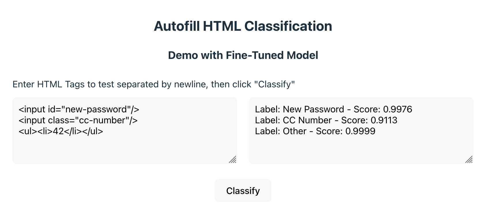

# Smart Autofill
Autofill HTML Tag Detection

This repo contains training code for the autofill model that can be used to predict labels (e.g. "Zip Code") from HTML tags. More information on the model can be found here: https://huggingface.co/Mozilla/tinybert-uncased-autofill.

### Requirements
First do the following steps to set up the virtual env and install the requirements,

```
cd smart_autofill
python3 -m venv smart_autofill
source smart_autofill/bin/activate
pip install -r requirements.txt
```

### Running Training & Inference
To run training, first download the HTML dataset to build the dataset from scratch
(please reach out for a sample dataset if needed, here's [one](https://huggingface.co/datasets/Mozilla/autofill-dataset) on hugging face; a larger dataset is also available), then run the commands below to start the training
and evaluation.

```shell
cd smart_autofill
source smart_autofill/bin/activate
cd src
# removes local cached model, allows increased memory for training then runs training
rm -rf google && PYTORCH_MPS_HIGH_WATERMARK_RATIO=0.0 python train.py
```

To run inference, update the `predict.py` file to add any tags and run with
the following commands once training is done,
```shell
cd smart_autofill
source smart_autofill/bin/activate
cd src
python predict.py
```

### Running the Streamlit App
```
cd smart_autofill/streamlit-app
python3 -m streamlit run infer.py
```

The app startup can take a few seconds while the model is loaded. Subsequent loads should be faster.
If a local model is present, the model can be loaded by updating `model=...` to the local directory containing the model artifacts.

<p align="center">
  
</p>

### Running the React App
```
cd smart_autofill/react-app
npm install
npm run dev
```

There should be a textarea with a "Classify" button. Add some HTML tags to test (separated by newlines) and click "Classify" to see the result.

<p align="center">
  
</p>
