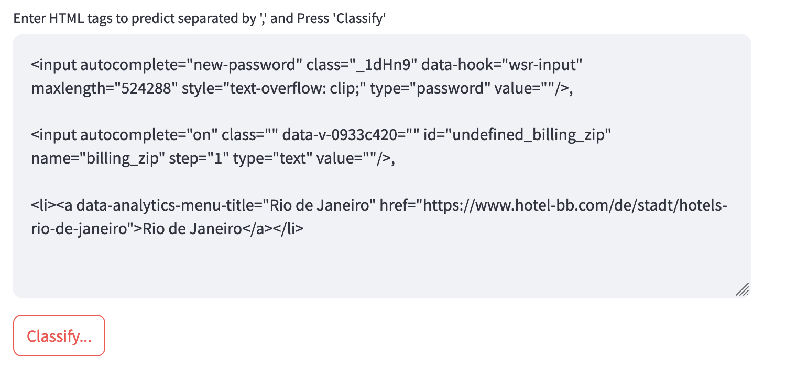

# Smart Autofill
Autofill HTML Tag Detection

Information on the model can be found here: https://huggingface.co/vazish/mobile_bert_autofill

## Requirements
First do the following steps to set up the virtual env and install the requirements,

```
cd smart_autofill
python3 -m venv smart_autofill
source smart_autofill/bin/activate
pip install -r requirements.txt
```

## Running the App
```
cd smart_autofill/app
python3 -m streamlit run infer.py
```

The app startup can take a few seconds while the model is loaded. Subsequent loads should be faster.

Once done, deactivate the virtual env with `deactivate` from the terminal

<p align="center">
  
</p>
